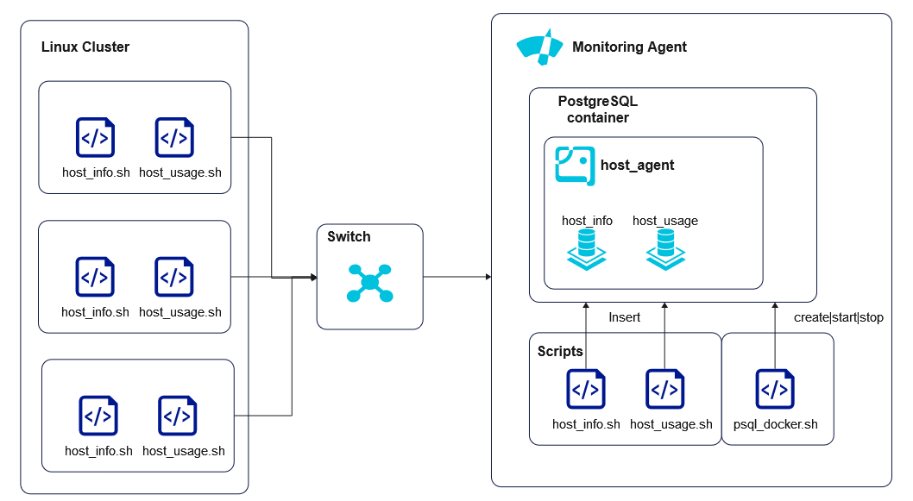

# Linux Cluster Monitoring Agent
This project implements a few utilities designed to help the Jarvis Cluster 
Administration (LCA) team collect system specifications as well as resource usage from each node 
running on their Linux cluster. The LCA team would use this information for 
real-time resource monitoring as well as planning how to allocate these resources in
the future.
The specifications and usage statistics are collected using bash scripts and stored in a
PostgreSQL database which runs in a Docker container. Usage statistics are gathered every minute 
and inserted into the database with timestamps.

# Quick Start
- Set up and start a PostgreSQL container using docker using psql_docker.sh
```bash
./scripts/psql_docker.sh create db_username db_password
./scripts/psql_docker.sh start db_username db_password
```
- Create a PostgreSQL database using `ddl.sql`
```bash
psql -h localhost -p 5432 -U db_username -d db_name -f sql/ddl.sql
```
- Collect system specs using `host_info.sh`
```bash
./scripts/host_info.sh localhost 5432 host_agent postgres password
```
- Collect system resource usage using `host_usage.sh`
```bash
./scripts/host_usage.sh localhost 5432 host_agent postgres password
```
- Set `host_usage.sh` to execute everyone minute
```bash
crontab -e
* * * * * bash [/absolute_path/host_usage.sh] localhost 5432 host_agent postgres password > /tmp/host_usage.log
```
# Implementation
## Architecture


## Scripts
- `psql_docker.sh` used to create/start/stop a PostgreSQL docker container
- `ddl.sql` used to create the host_info and host_usage tables in the PostgreSQL server
- `host_info.sh` collects a variety of system specifications:
  - **hostname** system hostname
  - **cpu_number** number of cpu cores
  - **cpu_architecture** cpu architecture
  - **cpu_model** cpu model
  - **cpu_mhz** cpu clock rate in megahertz
  - **l2_cache** l2 cache in kilobytes
  - **total_mem** total system RAM in kilobytes
  - **timestamp** Current time in UTC
- `host_usage.sh` collects a variety of system usage statistics:
  - **timestamp** Current time in UTC
  - **memory_free** amount of free RAM
  - **cpu_idle** percentage of unused cpu resources
  - **cpu_kernel** percentage of cpu used at the kernel level
  - **disk_io** I/Os taking place between RAM and disk 
  - **disk_available** available disk space

## Database Model
- `host_info`
```
  | Column Name      | Type      |
  |------------------|-----------|
  | id               | serial    |
  | hostname         | varchar   |
  | cpu_number       | int2      |
  | cpu_architecture | varchar   |
  | cpu_model        | varchar   |
  | l2_cache         | int4      |
  | timestamp        | timestamp |
  | total_mem        | int4      |
```
- `host_usage`
```
| Column Name    | Type   |
|----------------|--------|
| timestamp      | serial |
| memory_free    | int4   |
| cpu_idle       | int2   |
| cpu_kernel     | int2   |
| disk_io        | int4   |
| disk_available | int4   |
```


# Test
- The `psql_docker.sh` script was tested by running the `docker container ls -a` command to 
verify that the container was created
- The `ddl.sql` script was tested by executing `\l` in the psql terminal to verify that the 
tables were created
- The `host_info.sh` and `host_usage.sh` scripts were tested by querying their respective tables
to verify that the information was properly inserted 

# Improvements 
- Write SQL queries to gather insightful usage information "when does usage peak/bottom/etc"
- Visualize resource usage in real time
- Gather additional useful information such as which programs are using the most RAM