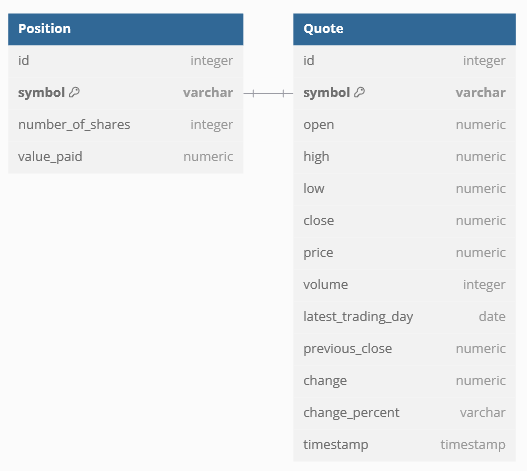

# Introduction
This is a Stock Quote application written in Java 
that allows users to simulate stock trading with real stock information.
It runs and receives inputs from the command line. 
The app pulls up-to-date stock quote information using the Alpha Vantage API and allows users to buy / sell 
stocks based off this information. 
Users are also able to view all their current positions and check their performance through built in commands. 
Users' stock positions are recorded using a PostgreSQL database which the program connects to via JDBC.
The app utilizes maven for dependency management and building. 
It is also Dockerized and can be found on dockerhub. 

# Implementaiton
## ER Diagram

## Design Patterns
The app implements the Data Access Object (DAO) and Repository design patterns to handle data transfer between 
the app and database in a clean and controlled manner. 
These design patterns also helps to decouple business logic from data storage / access logic.
The quote information and the user's positions are represented in code as Quote and Position objects. 
These two objects have DAO classes that implement the required methods to support CRUD operations.  
This results in specialized classes dedicated to handling the transfer of data between app and database which
in turn makes the code more modular and maintainable. 
By implementing the Repository design pattern and having each DAO class only deal with a single database table,
the code is also further simplified and easier to maintain. 

# Test
Testing of the application was done through unit and integration tests using JUnit and Mockito. 
During unit tests, Mockito was used to mock and database connection so that the classes could be tested
in isolation without worrying about database errors or altering live data in a database. 
A mocked database connection would return a mocked `resultSet` which contained all the 
necessary Quote / Position information as if it were a live database.
For integration tests, a PostgreSQL database running in a docker container was set up for testing purposes. 
The database contained two tables for storing Quote and Position information coming from the 
user / Alpha Vantage API. Tests would read/write sample data into this database to ensure that the
DAO classes are correctly implemented. 
