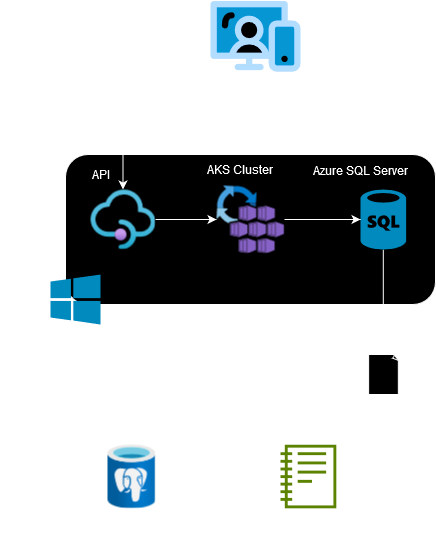

# Introduction
This project is a proof of concept utilizing data analytics techniques to analyze customer shopping behaviour of London Gift Shop (LGS).
LGS is UK-based online store that has been selling giftware for over a decade. Their primary customers are wholesalers. 
However, LGS has stopped seeing revenue growth in recent years, and does not have to resources to start a new data analysis project themselves. 
As a result, Jarvis Consulting was given the task with the objective of finding avenues to attract new and existing customers through targeted marketing campaigns. 
Retailed data was provided by the LGS IT team which was then loaded into a PostgreSQL database which acted as a data warehouse for the project. 
Jupyter notebooks along with the pandas and numpy libraries were used to manipulate and analyze the data. 
The analyzed data was plotted visually using matplotlib.

# Implementaion
## Project Architecture
  
The London Gift Shop web application utilizes an Azure Resource Group containing an Azure SQL Server to store their live transaction data.
Jarvis Consulting was provided a subset of the data from between 01/12/2009 - 09/12/2011 in the form of an sql file.  
The data in the sql file is loaded into a PostgreSQL database which acts as a data warehouse, and the processing is performed in Jupyter notebook. 

## Data Analytics and Wrangling
The prooft of concept data analysis can be found [here](./python_data_wrangling/retail_data_analytics_wrangling.ipynb)  
Some initial key observations show that sales growth has indeed been relatively flat over the course of the time period analyzed, fluctuating between a high of 1.4% and a low of 0.4%.  
When looking at the number of new users compared to existing users in during each month, we see that the number of new users drops off significantly. Marketing campaigns targeted towards attracting new customers is suggested to boost growth. 
By performing RFM (Recency, Frequency, Monetary) Segmentation on customers, we are able to divide the customers into different categories to target in marketing campaigns. One segment of note is the "Can't Lose" segment which boasts a high frequency score but low recency score meaning they are no longer making as many purchases as they have in the past. This segment should be targeted as they can potentially become "Champions" if they return to our business. Another segment of note is the "Loyal Customers" segment which over make up a large percentage of customers. These customers consistently make purchases and it should be ensured that they remain loyal customers into the future. 

# Improvements
1. Look at what types of purchases are commonly be made by different types of customers 
2. Look for different ways to divide customers into segments 
3. Look for data to help identify why the number of new customers has dropped over time