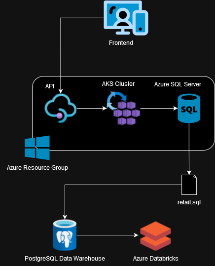

# Introduction
This project is split into two parts. The first part involves the use of Zeppelin and Hadoop to analyze the World Development Indicators dataset and find usefull statistics. 
Google Cloud Platform's Dataproc service was used to create the Hadoop clusters and host the Zeppelin notebook for the project. 
The second part of the project involved the use of Databricks to analyze customer shopping behaviour from an online retailer.
The retail data was loaded into Databricks from a PostgreSQL database. The analysis was done using PySpark to find useful data such as monthly revenue and customer growth,
number of canceled orders, and RFM segmentation. For both these projects, Spark was chosen for this distributed computation capabilities and the ability to handle 
large datasets that would not fit into memory on a single machine. 

# Databricks and Hadoop Implementation
  
The proof of concept data analysis can be found [here](./notebook/Retail%20Data Analytics%20with%20PySpark.ipynb)  
The dataset contains transaction records with: invoice number, stock code, item description, quanity, invoice date, unit price, customer id, country  
Some initial key observations show that sales growth has indeed been relatively flat over the course of the time period analyzed, fluctuating between a high of 1.4% and a low of 0.4%.  
When looking at the number of new users compared to existing users in during each month, we see that the number of new users drops off significantly. Marketing campaigns targeted towards attracting new customers is suggested to boost growth. 
By performing RFM (Recency, Frequency, Monetary) Segmentation on customers, we are able to divide the customers into different categories to target in marketing campaigns. One segment of note is the "Can't Lose" segment which boasts a high frequency score but low recency score meaning they are no longer making as many purchases as they have in the past. This segment should be targeted as they can potentially become "Champions" if they return to our business. Another segment of note is the "Loyal Customers" segment which over make up a large percentage of customers. These customers consistently make purchases and it should be ensured that they remain loyal customers into the future. 

# Zeppelin and Hadoop Implementation
The dataset is the World Development Indicators dataset from the World Bank. It contains various indicators of development for 217 economies and over 40 country groups. 
Zeppelin was used to find and plot various statistics including Canadian GDP, GDPs ranked in descending order, among other statistics. 

# Improvements
1. Look at what types of purchases are commonly be made by different types of customers 
2. Look for different ways to divide customers into segments 
3. Look for data to help identify why the number of new customers has dropped over time